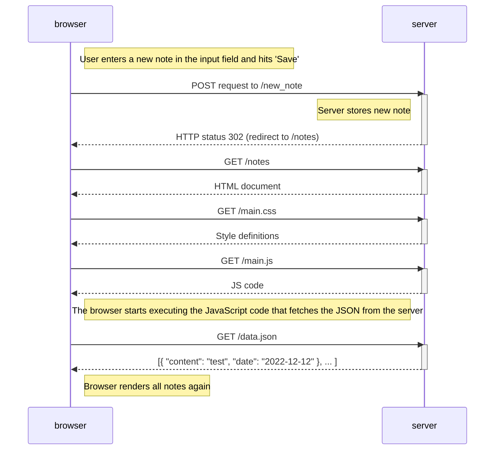

```mermaid
sequenceDiagram
    participant browser
    participant server

    Note right of browser: User enters a new note in the input field and hits 'Save'

    browser->>server: POST request to /new_note
    activate server
    Note left of server: Server stores new note
    server-->>browser: HTTP status 302 (redirect to /notes)
    deactivate server

    browser->>server: GET /notes
    activate server
    server-->>browser: HTML document
    deactivate server

    browser->>server: GET /main.css
    activate server
    server-->>browser: Style definitions
    deactivate server

    browser->>server: GET /main.js
    activate server
    server-->>browser: JS code
    deactivate server

    Note right of browser: The browser starts executing the JavaScript code that fetches the JSON from the server

    browser->>server: GET /data.json
    activate server
    server-->>browser: [{ "content": "test", "date": "2022-12-12" }, ... ]
    deactivate server

    Note right of browser: Browser renders all notes again
```