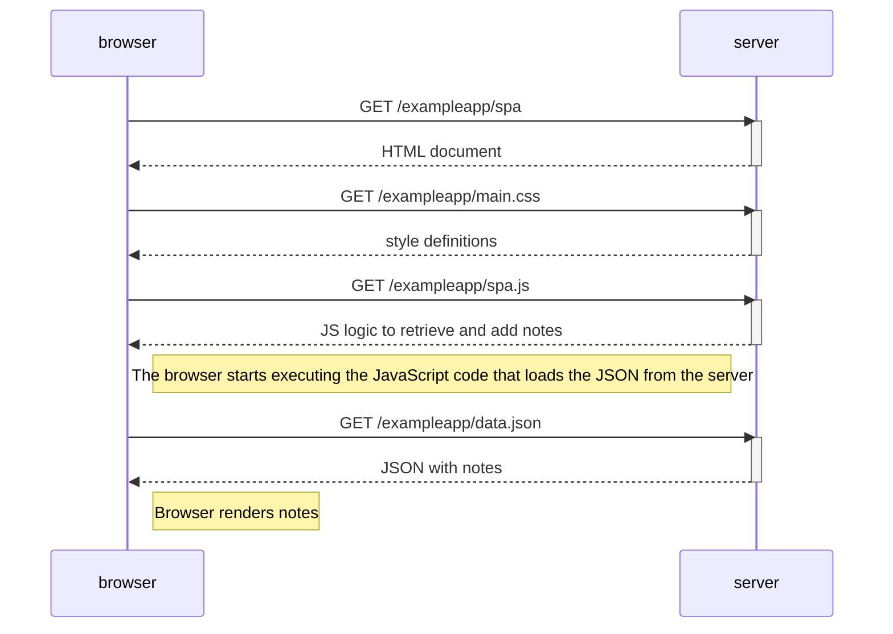

```mermaid
sequenceDiagram
    participant browser
    participant server

    browser->>server: GET /exampleapp/spa
    activate server
    server-->>browser: HTML document
    deactivate server

    browser->>server: GET /exampleapp/main.css
    activate server
    server-->>browser: style definitions
    deactivate server

    browser->>server: GET /exampleapp/spa.js
    activate server
    server-->>browser: JS logic to retrieve and add notes
    deactivate server

    Note right of browser: The browser starts executing the JavaScript code that loads the JSON from the server

    browser->>server: GET /exampleapp/data.json
    activate server
    server-->>browser: JSON with notes
    deactivate server

    Note right of browser: Browser renders notes

```