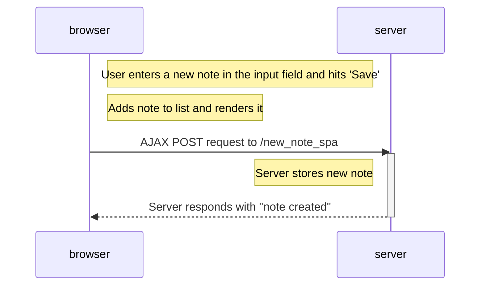

```mermaid
sequenceDiagram
    participant browser
    participant server

    Note right of browser: User enters a new note in the input field and hits 'Save'

    Note right of browser: Adds note to list and renders it

    browser->>server: AJAX POST request to /new_note_spa
    activate server
    Note left of server: Server stores new note
    server-->>browser: Server responds with "note created"
    deactivate server


```